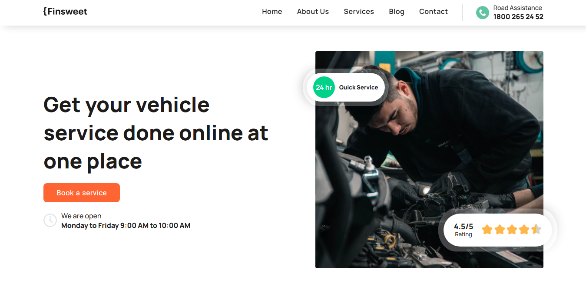

# 🚗 Finsweet Auto Service Website

A multi-page responsive website for **Finsweet**, an online car service and repair business. Built to provide users with an easy, transparent, and professional way to book and manage their vehicle servicing online.

## 🌐 Live Demo

> [🔗 View Live Site](https://taw-sip.github.io/Finsweet/)

---

## 📸 Screenshots

### 💻 Desktop View



### 📱 Mobile View


---

## 📄 Pages Included

- `Home:` Service overview, testimonials, and brand trust.
- `About Us:` Mission, vision, and team information.
- `Services :` Overview of all offered auto services.
  - `service-single :` Detailed view of a specific service.
- `Blog:` Industry news, car maintenance tips, and articles.
  - `blog-single :` Full post view with comments and metadata.
- `Contact Us:` Inquiry form, location map, and business details.

---

## 💡 Features

- 🧰 Full auto repair service categories (Diagnostics, Engine, Wheels, etc.)
- 📝 Quote request and appointment booking forms
- 📱 Responsive and mobile-first design
- ⭐ Customer testimonials and ratings
- 🔒 FAQ for transparency and support
- 📈 Professional design layout with call-to-actions

---

## 🛠️ Tech Stack

- **HTML5 / CSS3 / JavaScript**
- **Icons:** FontAwesome / Custom SVGs
- **Fonts:** Google Fonts (Manrope, Roboto)
- **Design Tool Used:** Figma / Photoshop

---

## 📁 Folder Structure

```
/finsweet-auto-service/
├── index.html
├── about.html
├── services.html
├── services-single.html
├── blog.html
├── blog-single.html
├── contact.html
├── css/
├── js/
├── images/
└── README.md
```

---

## 🚀 Getting Started

To run locally:

```bash
git clone https://github.com/Taw-sip/Finsweet.git
cd Finsweet
open index.html
```

---

## 📃 License

This project is licensed under the MIT License – see the [LICENSE](LICENSE) file for details.

---

## 🙋‍♂️ Author

**Abu Nayem**  
[Portfolio](https://yourportfolio.com) | [LinkedIn](https://linkedin.com/in/johndoe) | [Email](mailto:tawsip777@gmail.com)
